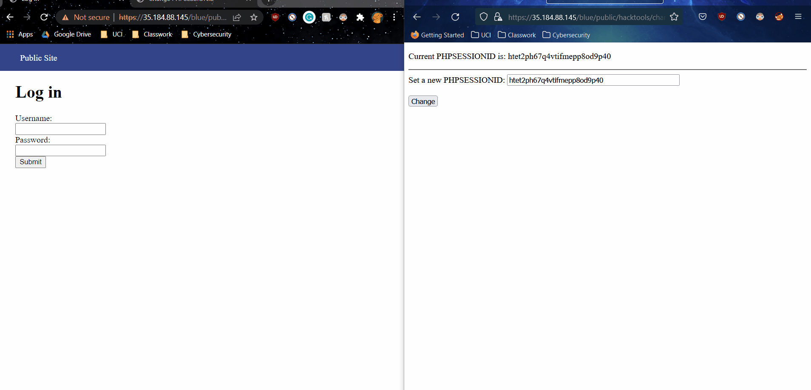
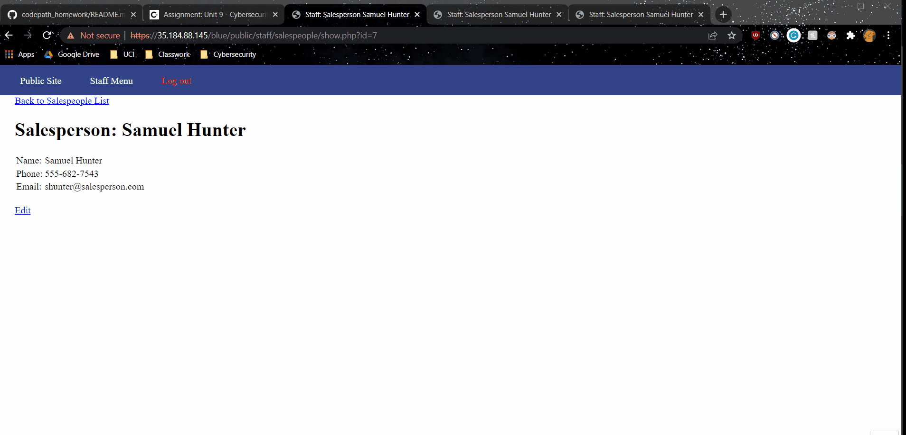

# Project 8 - Pentesting Live Targets

Time spent: **5** hours spent in total

> Objective: Identify vulnerabilities in three different versions of the Globitek website: blue, green, and red.

The six possible exploits are:

* Username Enumeration
* Insecure Direct Object Reference (IDOR)
* SQL Injection (SQLi)
* Cross-Site Scripting (XSS)
* Cross-Site Request Forgery (CSRF)
* Session Hijacking/Fixation

Each color is vulnerable to only 2 of the 6 possible exploits. First discover which color has the specific vulnerability, then write a short description of how to exploit it, and finally demonstrate it using screenshots compiled into a GIF.

## Blue

Vulnerability #1: Session Hijacking.

Description: 
In the GIF, the user manually logs into the blue website on a first browser (Chrome) and copies the generated PHPSESSIONID that was gathered from that login onto a separate browser (FireFox). The malicious individual was able to then log into the blue web page without ever needing to impact their own account credentials. 

Vulnerability #2: SQL Injection

Description: Although very trivial, upon visiting the "Salesperson List" and injecting the command " OR 1=1--' into the URL, the malicious individual was able to change the currently viewed user into an entirely different user (as highlighted). When replicated on the other website, no apparent change was apparent. By not sanitizinig this URL input, a more tenacious third party could further exploit the vulnerability and gain access to more latent information. 

## Green

Vulnerability #1: __________________

Description:

Vulnerability #2: __________________

Description:

## Red

Vulnerability #1: __________________

Description:

Vulnerability #2: __________________

Description:

## Notes

Describe any challenges encountered while doing the work
