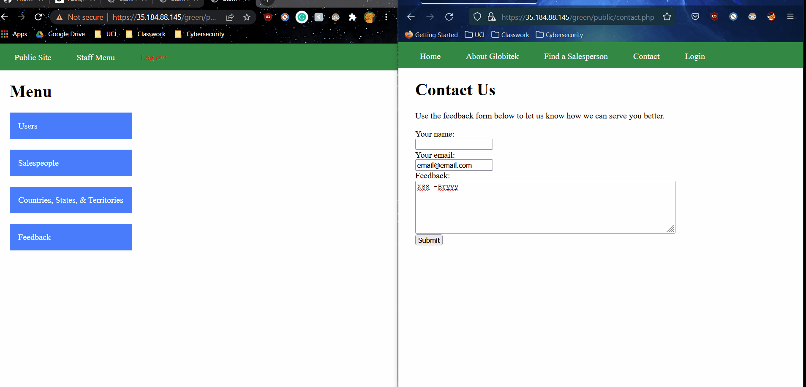
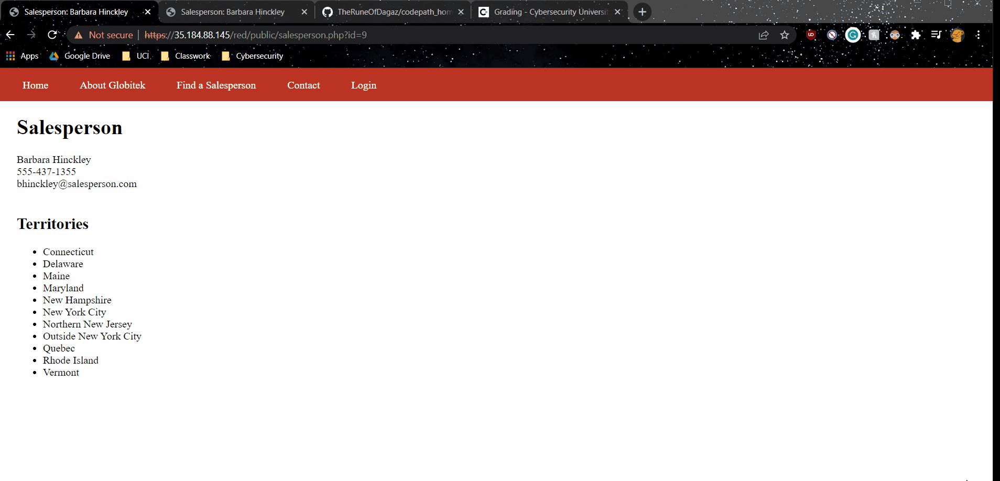

# Project 8 - Pentesting Live Targets

Time spent: **5** hours spent in total

> Objective: Identify vulnerabilities in three different versions of the Globitek website: blue, green, and red.

The six possible exploits are:

* Username Enumeration
* Insecure Direct Object Reference (IDOR)
* SQL Injection (SQLi)
* Cross-Site Scripting (XSS)
* Cross-Site Request Forgery (CSRF)
* Session Hijacking/Fixation

Each color is vulnerable to only 2 of the 6 possible exploits. First discover which color has the specific vulnerability, then write a short description of how to exploit it, and finally demonstrate it using screenshots compiled into a GIF.

## Blue

Vulnerability #1: Session Hijacking.

Description: 
In the GIF, the user manually logs into the blue website on a first browser (Chrome) and copies the generated PHPSESSIONID that was gathered from that login onto a separate browser (FireFox). The malicious individual was able to then log into the blue web page without ever needing to impact their own account credentials. 

Vulnerability #2: SQL Injection

Description: Although very trivial, upon visiting the "Salesperson List" and injecting the command "' OR 1=1--'" into the URL, the malicious individual was able to change the currently viewed user into an entirely different user (as highlighted). When replicated on the other website, no apparent change was apparent. By not sanitizinig this URL input, a more tenacious third party could further exploit the vulnerability and gain access to more latent information. 

## Green

Vulnerability #1: Cross-Site Scripting

Description: This was one of the simplest exploits to find (because the user had fallen victim to it randomly while searching for vulnerabilities since other peers are also providing penetration testing). The user inputs the following script into the "Your name" field in the contact field: "". Upon viewing the website through the admin, various alerts were transmitted that showed the user had fallen victim to a cross-site scripting attack. The third alert provides proof that the correct user created the script.

Vulnerability #2: __________________

Description:

## Red

Vulnerability #1: Insecure Direct Object Reference

Description: On the red website, a normal user notices that the website URL locates salespersons through an incremenetal ID number. However, for the red website, a user is able to logically conclucde and include the next user after number 9 to acquire information regarded to previously fired and future employees. When emulated on another website (say the blue website), using an ID over 9 will simply redirect the userback to the "Find a Salesperson" page. This vulnerability was quite easy to find when reading the page URLs, since indicating employees through a simple incremental number ID will immediately cause a user to grow suspicious. 

Vulnerability #2: __________________

Description:

## Notes

Describe any challenges encountered while doing the work
